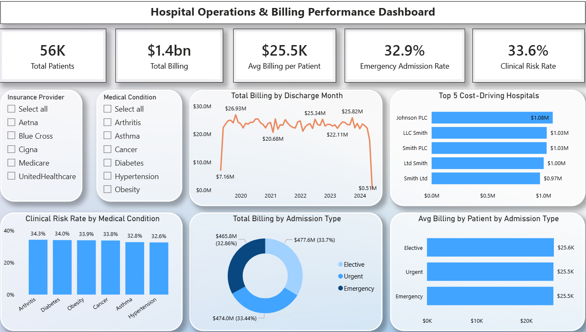

# 🏥 Healthcare Analytics: Hospital Operations & Billing Performance

---

## 📖 Project Overview  

An **interactive Power BI dashboard** built to analyze **hospital billing performance and operational drivers** across patients, admission types, hospitals, and clinical risk indicators.

This project enables **healthcare and business stakeholders** to gain visibility into **revenue patterns, cost concentration, admission mix, and clinical risk exposure**, supporting **data-driven decisions** for cost control, resource planning, and operational efficiency.

🔗 **Live Interactive Power BI Dashboard:**  
Click the image above to explore the report

---

## 🎯 Project Goal  

Provide stakeholders with a **clear, consolidated view of hospital billing and operational performance** to support:

- Cost management  
- Resource and capacity planning  
- Operational efficiency  
- Clinical risk monitoring  

---

## 📊 Key Business Insights  

### 💵 Billing Performance  
- **$1.4B** total billing across **56K patients**  
- **$25.5K** average billing per patient  
- Billing remains **stable across discharge months**, indicating predictable revenue trends  

### 🚑 Operational Impact on Billing  
- **Emergency admissions contribute 33%** of total billing  
- Billing is **evenly distributed across Elective, Urgent, and Emergency admissions**, reflecting a **balanced admission mix**  

### 🏨 Cost Concentration  
- Billing is **concentrated among a limited number of hospitals**  
- **Top 5 hospitals each contribute $1M+** in total billing  
- Highlights opportunities for **performance benchmarking and cost optimization**  

### 🧪 Clinical Risk Considerations  
- **Abnormal test rates range from 32%–35%** across medical conditions  
- Persistent abnormal test results may lead to:
  - Additional diagnostic tests  
  - Follow-up treatments  
  - Increased overall **cost of care**  

---

## 📌 Business Takeaway  

Hospital billing performance is driven by a combination of:
- **Balanced admission mix**
- **Hospital-level cost concentration**
- **Consistent clinical risk exposure**

Targeted interventions at **high-billing hospitals** and **risk-prone clinical areas** can improve **cost efficiency while maintaining care quality**.

---

## 📈 Dashboard Features  

### 🔑 KPI Metrics  
- **Total Billing Amount**  
- **Total Patients**  
- **Average Billing per Patient**  

### 📊 Visuals Included  
- Monthly Billing Trends  
- Hospital-wise Billing Distribution  
- Admission Type Analysis (Elective, Urgent, Emergency)  
- Abnormal Test Rate by Medical Condition  
- Top Hospitals by Total Billing  

---

## 📂 Files in Repository  

| File Name | Description |
|----------|-------------|
| `Hospital_Operations_Billing.pbix` | Power BI source file |
| `Hospital_Billing_Report.pdf` | Exported report for offline viewing |
| `Hospital_Billing_Dashboard.png` | Dashboard preview screenshot |
| `README.md` | Project documentation |

---

## 🛠 Tools & Technologies  

- **Power BI Desktop** – Dashboard design & visualization  
- **Power Query** – Data cleaning and transformation  
- **DAX** – KPI calculations and measures  
- **Healthcare Dataset (Synthetic)** – Billing and operations data  
- **GitHub** – Version control and portfolio showcase  

---

## 🔧 Functionalities Demonstrated  

- Healthcare billing and revenue analysis  
- Operational performance analytics  
- Cost concentration identification  
- Admission mix evaluation  
- Clinical risk impact analysis  
- Interactive dashboards and drill-downs  
- Business-focused data storytelling  

---

## 📌 Why This Project?  

Healthcare organizations face challenges such as:
- Rising operational and treatment costs  
- Uneven hospital performance  
- Increasing diagnostic and follow-up expenses  

This dashboard helps stakeholders:
- Monitor **financial and operational performance**
- Benchmark hospitals effectively
- Optimize resource allocation
- Track clinical risk drivers impacting cost  

It demonstrates how **Power BI enables enterprise-grade healthcare analytics** beyond static reporting.

---

## 👥 Who Benefits from This Dashboard?  

- Hospital Leadership & Executives  
- Healthcare Operations Teams  
- Finance & Revenue Cycle Teams  
- Healthcare Data Analysts  

---

## 🚀 Impact  

With this dashboard, stakeholders can:
- Identify **high-cost hospitals and billing drivers**
- Monitor **revenue stability and trends**
- Understand **clinical risk exposure**
- Improve **operational efficiency and cost planning**

This project showcases **end-to-end healthcare analytics using Power BI** with a strong **business and operational focus**.

---

## 👨‍💻 Connect With Me  

[LinkedIn – Vamshi Krishna Reddy](https://www.linkedin.com/in/vam5h1/)

Actively seeking **Data Analyst / Business Analyst / Reporting Analyst roles**, where I can apply **Power BI, SQL, and healthcare analytics** to deliver **actionable insights**.
